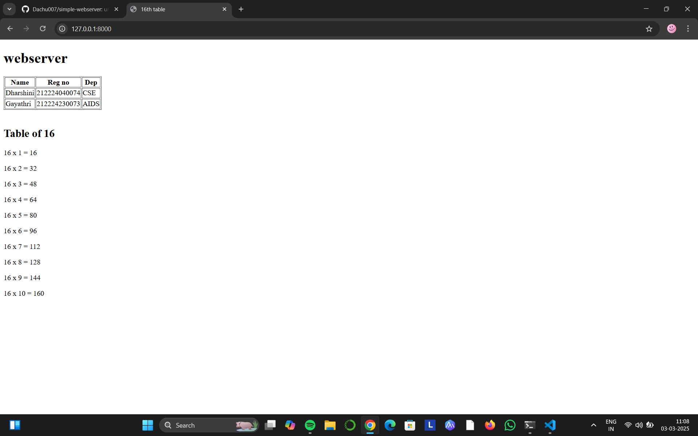

 
# EX01 Developing a Simple Webserver
## Date:

## AIM:
To develop a simple webserver to serve html pages and display the configuration details of laptop.

## DESIGN STEPS:
### Step 1: 
HTML content creation.

### Step 2:
Design of webserver workflow.

### Step 3:
Implementation using Python code.

### Step 4:
Serving the HTML pages.

### Step 5:
Testing the webserver.

## PROGRAM:
```html
<!DOCTYPE html>
<html lang="en">
<head>
    <meta charset="UTF-8">
    <meta name="viewport" content="width=device-width, initial-scale=1.0">
    <title>16th table</title>
</head>
<body>
    <h1>webserver</h1>
    <table border="1">
        <tr>
            <th>Name</th>
            <th>Reg no</th>
            <th>Dep</th>
        </tr>
        <tr>
            <td>Dharshini</td>
            <td>212224040074</td>
            <td>CSE</td>
        </tr>
        <tr>
            <td>Gayathri</td>
            <td>212224230073</td>
            <td>AIDS</td>
        </tr>
        </table>
        <br>
        <h2>Table of 16</h2>
        <p>16 x 1 = 16</p>
        <p>16 x 2 = 32</p>
        <p>16 x 3 = 48</p>
        <p>16 x 4 = 64</p>
        <p>16 x 5 = 80</p>
        <p>16 x 6 = 96</p>
        <p>16 x 7 = 112</p>
        <p>16 x 8 = 128</p>
        <p>16 x 9 = 144</p>
        <p>16 x 10 = 160</p>


    
</body>
</html>
```


## OUTPUT:



## RESULT:
The program for implementing simple webserver is executed successfully.
